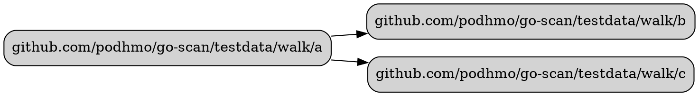
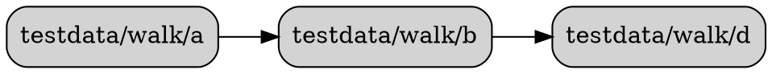

# deps-walk

`deps-walk` is a command-line tool that visualizes the dependency graph of packages within a Go module. It is built upon the `go-scan` library's `Walk` API.

## Purpose

This tool helps developers understand the internal architecture of a Go project by generating a focused dependency graph. Unlike tools that visualize an entire project's dependencies, `deps-walk` can limit the scope of the graph, making it easier to answer questions like, "What are the immediate dependencies of this package?" or "How do these components interact within two hops?"

The tool outputs a dependency graph in the DOT language, which can be rendered into an image using tools like [Graphviz](https://graphviz.org/).

## Features

- **Dependency Traversal**: Uses `go-scan`'s efficient "imports-only" scanning mode to walk the dependency tree.
- **Hop Count Limiting**: Allows you to specify the maximum number of hops (degrees of separation) to explore from the starting package using the `--hops` flag.
- **Package Filtering**: Supports ignoring specific packages or package patterns (e.g., common utilities, logging) using the `--ignore` flag to declutter the graph.
- **Configurable Scope**: By default, it traverses only packages within the current Go module. The `--full` flag can be used to include external dependencies (from the standard library or third-party modules).
- **DOT Output**: Generates a graph in the DOT format, ready for visualization.
- **Multiple Output Formats**: Supports graph generation in DOT (default) and Mermaid formats via the `--format` flag.
- **Path Shortening**: The `--short` flag simplifies package paths in the output by omitting the module prefix.

## Usage

You can run the tool by specifying a starting package. You can also choose the output format.

### Generating a DOT graph (default)
```bash
$ go run ./examples/deps-walk -start-pkg=github.com/podhmo/go-scan/testdata/walk/a
```

### Generating a Mermaid graph
```bash
$ go run ./examples/deps-walk -start-pkg=github.com/podhmo/go-scan/testdata/walk/a -format=mermaid
```

### Basic Example

To see the direct dependencies of the `github.com/podhmo/go-scan/testdata/walk/a` package within the `go-scan` module:

```bash
# from the repository root
$ go run ./examples/deps-walk -start-pkg=github.com/podhmo/go-scan/testdata/walk/a -hops=1
```

This will produce the following DOT output:



### Advanced Example

To visualize a 2-hop dependency graph, ignoring package `c`, and shortening the package names in the output:

```bash
# from the repository root
$ go run ./examples/deps-walk \
    -start-pkg=github.com/podhmo/go-scan/testdata/walk/a \
    -hops=2 \
    -ignore="github.com/podhmo/go-scan/testdata/walk/c" \
    -short
```

This generates a DOT file that can be rendered with Graphviz to create an image like this:


