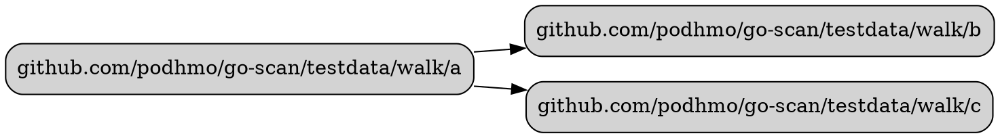
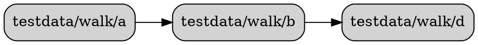

# deps-walk

`deps-walk` is a command-line tool that visualizes the dependency graph of packages within a Go module. It is built upon the `go-scan` library's `Walk` API.

## Purpose

This tool helps developers understand the internal architecture of a Go project by generating a focused dependency graph. Unlike tools that visualize an entire project's dependencies, `deps-walk` can limit the scope of the graph, making it easier to answer questions like, "What are the immediate dependencies of this package?" or "How do these components interact within two hops?"

The tool outputs a dependency graph in the DOT language, which can be rendered into an image using tools like [Graphviz](https://graphviz.org/).

## Features

- **Dependency Traversal**: Uses `go-scan`'s efficient "imports-only" scanning mode to walk the dependency tree.
- **Hop Count Limiting**: Allows you to specify the maximum number of hops (degrees of separation) to explore from the starting package using the `--hops` flag.
- **Package Filtering**: Supports ignoring specific packages or package patterns (e.g., common utilities, logging) using the `--ignore` flag. You can also hide packages from the output without excluding them from the traversal using the `--hide` flag.
- **Configurable Scope**: By default, it traverses only packages within the current Go module. The `--full` flag can be used to include external dependencies (from the standard library or third-party modules).
- **DOT Output**: Generates a graph in the DOT format, ready for visualization.
- **Multiple Output Formats**: Supports graph generation in DOT (default), Mermaid, and JSON formats via the `--format` flag.
- **Path Shortening**: The `--short` flag simplifies package paths in the output by omitting the module prefix.

## Usage

You can run the tool by specifying one or more starting packages as positional arguments. You can also choose the output format.

### Generating a DOT graph (default)
```bash
$ go run ./examples/deps-walk github.com/podhmo/go-scan/testdata/walk/a
```

### Generating a Mermaid graph
```bash
$ go run ./examples/deps-walk --format=mermaid github.com/podhmo/go-scan/testdata/walk/a
```

### Generating JSON output
```bash
$ go run ./examples/deps-walk --format=json github.com/podhmo/go-scan/testdata/walk/a
```

The JSON output includes the configuration of the run and separate fields for forward and reverse dependencies.

### Analyzing Multiple Packages

You can pass multiple package paths as arguments. The tool will run the analysis for each package and print the corresponding graphs separated by two newlines.

```bash
# from the repository root
$ go run ./examples/deps-walk \
    github.com/podhmo/go-scan/testdata/walk/a \
    github.com/podhmo/go-scan/testdata/walk/d
```

### Using Relative Paths

Instead of a full package import path, you can also provide a relative file path (e.g., `./cmd/my-app`). `deps-walk` will automatically find the `go.mod` file in the parent directories and resolve the path to its correct package path.

For example, to analyze the package in the current directory:

```bash
# from the repository root, to analyze the package in ./examples/deps-walk/testdata/walk/a
$ go run ./examples/deps-walk ./examples/deps-walk/testdata/walk/a
```

This will produce the same output as providing the full package path.

### Basic Example

To see the direct dependencies of the `github.com/podhmo/go-scan/testdata/walk/a` package within the `go-scan` module:

```bash
# from the repository root
$ go run ./examples/deps-walk --hops=1 github.com/podhmo/go-scan/testdata/walk/a
```

This will produce the following DOT output:



### Advanced Example

To visualize a 2-hop dependency graph, ignoring package `c`, and shortening the package names in the output:

```bash
# from the repository root
$ go run ./examples/deps-walk \
    --hops=2 \
    --ignore="github.com/podhmo/go-scan/testdata/walk/c" \
    --short \
    github.com/podhmo/go-scan/testdata/walk/a
```

This generates a DOT file that can be rendered with Graphviz to create an image like this:



### Hiding vs. Ignoring Packages

The tool provides two ways to exclude packages from the graph:

-   `--ignore="<pattern>"`: This completely excludes a package from the analysis. The walker will not traverse through an ignored package, so neither the package itself nor any of its dependencies (that are not reached by other means) will appear in the graph. This is useful for removing large, irrelevant parts of the dependency tree (e.g., a logging framework).

-   `--hide="<pattern>"`: This only hides a package from the final output. The walker *will* traverse through the package to discover its dependencies, but the package itself and any direct edges to or from it will not be rendered. This is useful for removing intermediate "glue" packages while still seeing the relationship between the packages they connect.

## Reverse Dependencies

You can find which packages import a specific package by using the `--direction=reverse` flag.

```bash
$ go run ./examples/deps-walk \
    --direction=reverse \
    github.com/podhmo/go-scan/testdata/walk/c
```

This will output a graph showing that packages `a` and `b` import package `c`.

### Aggressive Search Mode

In very large repositories, the default reverse dependency search can be slow because it inspects every package in the module. For a much faster search, you can use the `--aggressive` flag.

```bash
$ go run ./examples/deps-walk \
    --direction=reverse \
    --aggressive \
    github.com/podhmo/go-scan/testdata/walk/c
```

This mode uses `git grep` to quickly find files that contain the import path. It then parses only those files to confirm the dependency. This requires `git` to be installed and the project to be a git repository. The output will be identical to the non-aggressive search.

#### Limitations of Aggressive Mode

Because this mode relies on `git grep`, it only searches within the files tracked in the current git repository. This means it cannot resolve reverse dependencies that cross module boundaries, such as:

-   Dependencies from other local modules referenced via a `replace` directive in `go.mod`.
-   Dependencies from external packages located in the Go module cache.

For a completely accurate dependency graph that includes these cases, run the tool without the `--aggressive` flag.
